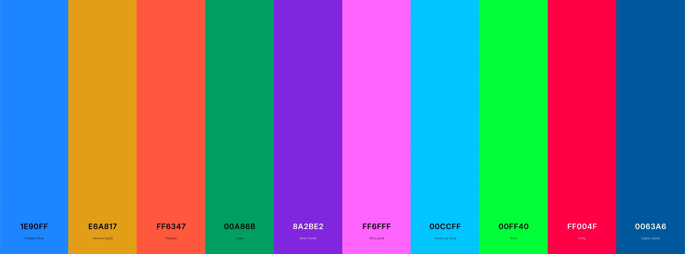

# 1. PlotUtils.py 
* contains functions for plotting and saving figures
* `setMplParam` sets mpl parameters to iterate over the lists of preset colours, markers, and linestyles
* `getColour`returns a colour from the list of preset colours
* 
* `getHistoParam` returns histogram parameters for a given array. The binwith, or the number of bins can be set by giving either as an argument of the function

# 2. ExternalFunctions.py
* contains add-ons for statistical fitting and plotting
* `add_text_to_ax(x_coord, y_coord, string, ax, fontsize=12, color='k')`: very useful for adding text to a plot